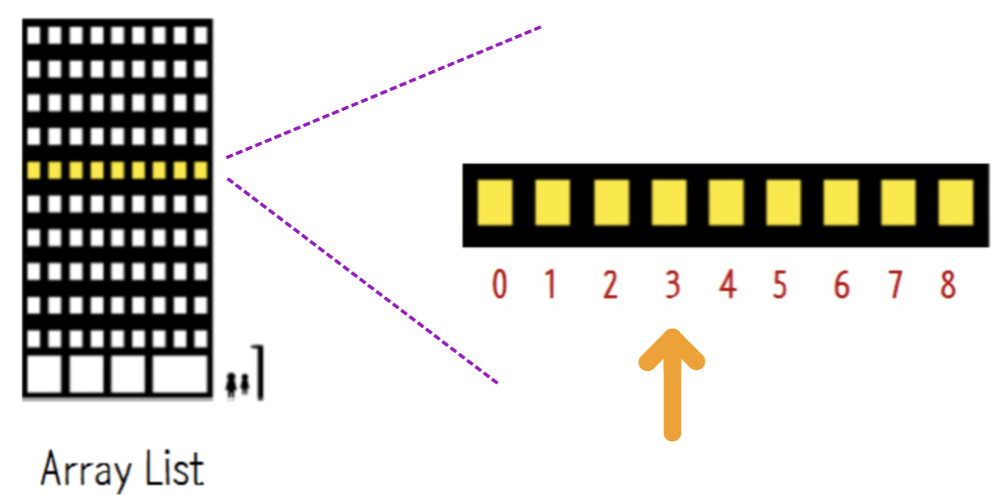
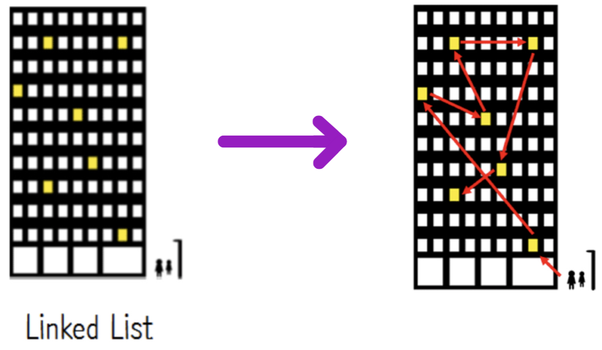

# 1. 링크드 리스트 : Linked List 의 개념

## 1.1. 링크드 리스트의 구조


- 데이터와 데이터 사이를 화살표로 연결하여 관리하는 데이터 구조.
- 배열(Array)와의 차이점
    

## 1.2. 링크드 리스트와 배열(Array)와 차이점

- 배열 : 번호가 붙여진(인덱싱이 된) 칸에 원소들을 채워 넣어 관리함.
- 링크드 리스트: 각 원소들을 줄줄이 엮어서 관리함.

### 1.2.1. 배열과 링크드 리스트의 비유적 비교 (출처: 생활코딩)

> 메모리라는 개념을 우리는 건물에 비유할 수 있을 것 같습니다. 아래 예시는 배열을 사용하는 것과 linked list를 사용하는 것을 비유해서 보여주고 있습니다. 여러분의 회사가 한 건물의 일부를 임대해서 사용한다고 생각해주세요.



> Array list의 첫 번째 회사는 모든 직원이 한곳에 모여있어야 한다는 철학이 있기 때문에 사무실이 모여있습니다. 배열은 건물을 이런 식으로 사용하는 것과 비슷합니다. 만약 **회사가 성장해서 사무실이 좁아지면 더 이상 새로운 직원을 뽑을 수 없습니다. 붙어있는 공간이 없기 때문이죠. 만약 더 많은 공간이 필요하다면 더 많은 사람을 수용할 수 있는 공간을 찾아서 전체가 이사해야 합니다.** Array list는 엘리먼트가 같은 곳에 모여있습니다. 만약에 3번째 자리로 가고 싶다면 한번에 3번째 방으로 갈 수 있습니다. 찾고자 하는 사무실이 몇 번째에 있는지 알고 있다면 Array list는 매우 빠릅니다.



> Linked List의 두 번째 회사는 한 건물 내에서 한 회사가 임대한 사무실이 서로 떨어져 있습니다. 덕분에 직원이 늘어도 큰 걱정이 없습니다. **건물에서 비어있는 곳 아무데나 임대해서 들어가면 되니까요.** 그런데 방문자가 사무실을 찾는 방법이 좀 비효율적입니다. 위의 그림에 있는 방문자가 3번째 사무실을 찾아가려면 우선 첫 번째 화살표의 사무실을 찾아가야 합니다. 이 사무실의 직원에게 다음 사무실이 어딘지 물어봅니다. 그럼 알려주는 사무실로 이동 한 후에 다시 물어봐서 그다음 사무실로 이동합니다. 이렇게 물어물어 사무실을 찾아가야 하는 방식이 Linked List입니다. 그래서 Linked List에서는 몇 번째 엘리먼트를 찾는 것이 느립니다. 

## 1.3. 링크드 리스트 관련 용어

- 노드(node): 
    - 데이터가 저장되는 단위. 
    - [데이터값, 포인터]로 구성
- 포인터(pointer): 
    - 다음 데이터의 주소를 담고 있는 공간.
    - 노드에서 다음 또는 이전 노드와의 연결 정보를 가지고 있는 공간.

## 1.4. 링크드 리스트의 장단점

장점:

- 데이터 공간을 미리 할당하지 않아도 됨. (array는 미리 데이터 공간을 할당해야 함.)
- 삽입과 삭제가 빠름. 따라서 삽입/삭제가 빈번히 일어날 때 많이 사용됨.


단점:

- 데이터 구조 표현에 소요되는 저장공간이 비교적 큼. 
    - 연결을 위한 별도의 데이터공간이 필요하기 때문에 저장공간 효율이 높지 않음.
- 데이터를 찾는 시간이 오래 걸림.
    - 인덱싱이 된 배열와는 달리, 특정 N번째 원소에 접근하려면 링크드 리스트의 처음부터 순차적으로 원소를 훑으며 N번째 원소를 찾아가야 함.
- 중간에 위치한 데이터 삭제 시, 앞뒤 데이터의 연결을 다시 구현해야하는 부가적인 작업이 필요함.

# 2. 파이썬에서의 링크드 리스트 pt.1

- 링크드 리스트는 C언어에서 주요한 데이터구조이지만,  파이썬에서는 리스트 타입이 링크드 리스트의 기능을 모두 지원함.

## 2.1. 노드 구현하기

```python
# 포인트가 없는 노드를 구현
class Node:
    def __init__(self, data):
        self.data = data
        self.next = None
```


```python
# 포인터가 있는 노드를 구현하기
class Node:
    def __init__(self, data, next=None):
        self.data = data
        self.next = next  # 포인터
```

## 2.2. 포인터를 활용하여 노드와 노드를 연결하기

```python
node1 = Node(1)
node2 = Node(2)
head = node1 # 링크드리스트의 첫 시작은 node1로 지정함.
node1.next =node2 # node1의 포인터에 node2를 저장하여 연결함.
```

```python
print(head.data) # node1의 데이터 출력
print(node1.next.data)  # node2의 데이터 출력
```
```pure_text
    1
    2
```

## 2.3. 링크드 리스트로 데이터 추가하기

```python
class Node:
    def __init__(self, data, next=None):
        self.data = data
        self.next = next
        
def add(data):
    node = head
    while node.next:
        node = node.next
    node.next = Node(data)
```

```python
node1 = Node(1) # 첫 번째 노드 생성
head = node1 # 첫 번째 노드를 head로 지정
for idx in range(2, 10): # 추가할 데이터를 iteration하며 추가하기
    add(idx)
```

## 2.4. 링크드 리스트 데이터 접근하여 출력하기


```python
# 한개씩 접근하기
print(head.data) # 1번째 노드
print(head.next.data) # 2번째 노드
print(head.next.next.data) # 3번째 노드
print(head.next.next.next.data) # 4번째 노드
```
```pure_text
    1
    2
    3
    4
```


```python
# 한꺼번에 접근하기
node = head
while node.next: # 노드의 데이터 순차적으로 출력
    print(node.data)
    node = node.next
print(node.data)   # next가 없는 마지막 노드의 데이터 출력
```
```pure_text
    1
    2
    3
    4
    5
    6
    7
    8
    9
```

## 2.5. 링크드 리스트의 중간 위치에 데이터 추가하기


### 2.5.1. 단순하게 추가해보기

```python
# 기존의 데이터 출력하기

node = head
while node.next:
    print(node.data)
    node = node.next
print(node.data)
```
```pure_text
    1
    2
    3
    4
    5
    6
    7
    8
    9
```


```python
node3_5 = Node(3.5) # 2와 3 사이에 위치할 데이터(2.5)가 담긴 노드 생성
```


```python
node = head
search = True 
while search:
    if node.data == 3: # 새 데이터(3.5)의 직전 데이터가 되는 노드(3)를 찾음.
        search = False # search 종료
    else:
        node = node.next
        
node_next = node.next # 노드(3)의 다음 노드(4)를 따로 빼기
node.next = node3_5 # 노드(3.5)를 노드(3)의 다음 노드로 연결
node3_5.next = node_next # 노드(4)을 노드(3.5)의 다음 노드로 연결
```


```python
node = head
while node.next:
    print(node.data)
    node = node.next
print(node.data)
```
```pure_text
    1
    2
    3
    3.5
    4
    5
    6
    7
    8
    9
```

# 3. 파이썬에서의 링크드 리스트 pt.2

## 3.1. 객체지향 프로그램으로 구현해보기


```python
class Node:
    def __init__(self, data, next=None):
        self.data = data
        self.next = next
```


```python
class NodeManagement:
    def __init__(self, data):
        self.head = Node(data)
        
    def add(self, data):
        """
        노드를 '순차적으로' 추가함.
        """
        if self.head == "":
            self.head = Node(data)
            
        else:
            node = self.head
            while node.next:
                node = node.next
            node.next = Node(data)
            
    def print_all(self):
        """
        노드를 순회하며 출력함.
        """
        node = self.head
        while node:
            print(node.data)
            node = node.next    
```

**링크드 리스트의 노드 모두 순회하며 데이터를 출력하기**

```python
linkedlist_1 = NodeManagement(0)
linkedlist_1.print_all()
```
```pure_text
    0
```


```python
for data in range(1, 10):
    linkedlist_1.add(data)
    
linkedlist_1.print_all()
```
```pure_text
    0
    1
    2
    3
    4
    5
    6
    7
    8
    9
```

## 3.2. 특정 데이터를 가진 노드 검색하기

- `search_node()` 메서드

```python
class Node:
    def __init__(self, data, next=None):
        self.data = data
        self.next = next
        
class NodeManagement:
    def __init__(self, data):
        self.head = Node(data)
        self.nodeCount = 1
        

    def add(self, data):
        """
        노드를 '순차적으로' 추가함.
        """
        if self.head == "":
            self.head = Node(data)
        else:
            node = self.head
            while node.next:
                node = node.next
            node.next = Node(data)
            self.nodeCount += 1


    def print_all(self):
        """
        노드를 순회하며 출력함.
        """
        node = self.head
        while node:
            print(node.data)
            node = node.next
                
                
    def search_node(self, data):
        """
        특정 데이터를 가진 노드 검색하기
        """
        node = self.head
        while node:
            if node.data == data: # 노드의 데이터가 찾고자 하는 데이터가 맞다면 그대로 리턴
                return node
            else:
                node = node.next # 다음 노드로 순회
```


```python
linkedlist_2 = NodeManagement(0)
for data in range(1, 10):
    linkedlist_2.add(data)
linkedlist_1.print_all()    
    
linkedlist_2.search_node(4).data # 데이터가 4인 노드의 데이터 출력
```
```pure_text
    0
    1
    2
    3
    4
    5
    6
    7
    8
    9
```
```pure_text
    4
```


## 3.3. 특정 인덱스의 노드 검색하기

- `get_node` 메서드

```python
class Node:
    def __init__(self, data, next=None):
        self.data = data
        self.next = next
        
class NodeManagement:
    def __init__(self, data):
        self.head = Node(data)
        self.nodeCount = 1
        

    def add(self, data):
        """
        노드를 '순차적으로' 추가함.
        """
        if self.head == "":
            self.head = Node(data)
        else:
            node = self.head
            while node.next:
                node = node.next
            node.next = Node(data)
            self.nodeCount += 1


    def print_all(self):
        """
        노드를 순회하며 출력함.
        """
        node = self.head
        while node:
            print(node.data)
            node = node.next

    
    def search_node(self, data):
        """
        특정 데이터를 가진 노드 검색하기
        """
        node = self.head
        while node:
            if node.data == data:
                return node
            else:
                node = node.next
    
    
    def get_node(self, position):
        """
        지정한 인덱스의 노드 가져오기
        """
        if position < 0 or position > self.nodeCount:
            print("Error: Position not in range of length of the linked list.")
            return None
        
        else:
            idx = 0
            node = self.head
            while idx < position:
                node = node.next
                idx += 1
            return node                    
```


```python
linkedlist_3 = NodeManagement(0)
for data in range(1, 10):
    linkedlist_3.add(data)

linkedlist_1.print_all()  # 전체 노드 데이터 출력
linkedlist_3.get_node(3).data   # 3번째 노드의 데이터 출력 
```
```pure_text
    0
    1
    2
    3
    4
    5
    6
    7
    8
    9
```
```pure_text
    3
```


## 3.2. 특정 노드 삭제하기

- `delete` ㅁㅔ서드

```python
class Node:
    def __init__(self, data, next=None):
        self.data = data
        self.next = next

        
class NodeManagement:
    def __init__(self, data):
        self.head = Node(data)
        self.nodeCount = 1
        

    def add(self, data):
        """
        노드를 '순차적으로' 추가함.
        """
        if self.head == "":
            self.head = Node(data)
        else:
            node = self.head
            while node.next:
                node = node.next
            node.next = Node(data)
            self.nodeCount += 1


    def print_all(self):
        """
        노드를 순회하며 출력함.
        """
        node = self.head
        while node:
            print(node.data)
            node = node.next

    
    def search_node(self, data):
        """
        특정 데이터를 가진 노드 검색하기
        """
        node = self.head
        while node:
            if node.data == data:
                return node
            else:
                node = node.next
    
    
    def get_node(self, position):
        """
        지정한 인덱스의 노드 가져오기
        """
        if position < 0 or position > self.nodeCount:
            print("Error: Position not in range of length of the linked list.")
            return None
        
        else:
            idx = 0
            node = self.head
            while idx < position:
                node = node.next
                idx += 1
            return node                    
            
            
    def delete(self, data):
        """
        특정 데이터를 가진 노드 삭제
        """
        if self.head == "":
            print("No node avaible")
            return
        
        if self.head.data == data:  # 삭제하고자 하는 데이터가 가장 첫 번째 노드일 때
            temp = self.head 
            self.head = self.head.next
            del temp
        else:
            node = self.head
            while node.next:
                if node.next.data == data:  # 삭제하고자 하는 데이터가 다음 노드에 있을 때
                    temp = node.next
                    node.next = node.next.next # 다음 노드를 건너 뛰고, 다음다음 노드를 바로 연결
                    del temp
                    pass
                else:
                    node = node.next
```

**노드를 한개(헤드) 만들어서 `delete` 메서드 실험하기**

```python
linkedlist_4 = NodeManagement(0)
linkedlist_4.print_all()
```
```pure_text
    0
```


```python
linkedlist_4.head  # 헤드가 존재함
```
```pure_text
    <__main__.Node at 0x107e94d10>
```


```python
linkedlist_4.delete(0) # 헤드를 삭제
```
```python
linkedlist_4.head # 헤드 삭제 후에는 헤드가 출력되지 않음
```


```python
linkedlist_4.print_all() # 링크드 리스트에 노드가 존재하지 않음
```

**여러 노드를 추가해서 `delete` 메서드 실험하기**


```python
linkedlist_5 = NodeManagement(0)

for data in range(1, 10):
    linkedlist_5.add(data)
    
linkedlist_5.print_all()
```
```pure_text
    0
    1
    2
    3
    4
    5
    6
    7
    8
    9
```


```python
linkedlist_5.delete(6)  # 노드 한개를 삭제함
linkedlist_5.print_all()
```
```pure_text
    0
    1
    2
    3
    4
    5
    7
    8
    9
```


```python
linkedlist_5.delete(3)
linkedlist_5.print_all()
```
```pure_text
    0
    1
    2
    4
    5
    7
    8
    9
```

## 3.3. 새 노드 중간에 삽입하기

- `insert` 메서드

```python
class Node:
    def __init__(self, data, next=None):
        self.data = data
        self.next = next

        
class NodeManagement:
    def __init__(self, data):
        self.head = Node(data)
        self.nodeCount = 1
        

    def add(self, data):
        """
        노드를 '순차적으로' 추가함.
        """
        if self.head == "":
            self.head = Node(data)
        else:
            node = self.head
            while node.next:
                node = node.next
            node.next = Node(data)
            self.nodeCount += 1


    def print_all(self):
        """
        노드를 순회하며 출력함.
        """
        node = self.head
        while node:
            print(node.data)
            node = node.next

    
    def search_node(self, data):
        """
        특정 데이터를 가진 노드 검색하기
        """
        node = self.head
        while node:
            if node.data == data:
                return node
            else:
                node = node.next
    
    
    def get_node(self, position):
        """
        지정한 인덱스의 노드 가져오기
        """
        if position < 0 or position > self.nodeCount:
            print("Error: Position not in range of length of the linked list.")
            return None
        
        else:
            idx = 0
            node = self.head
            while idx < position:
                node = node.next
                idx += 1
            return node                    
            
            
    def delete(self, data):
        """
        특정 데이터를 가진 노드 삭제
        """
        if self.head == "":
            print("No node avaible")
            return
        
        if self.head.data == data:  # 삭제하고자 하는 데이터가 가장 첫 번째 노드일 때
            temp = self.head 
            self.head = self.head.next
            del temp
        else:
            node = self.head
            while node.next:
                if node.next.data == data:  # 삭제하고자 하는 데이터가 다음 노드에 있을 때
                    temp = node.next
                    node.next = node.next.next # 다음 노드를 건너 뛰고, 다음다음 노드를 바로 연결
                    del temp
                    pass
                else:
                    node = node.next

                    
    def insert(self, data, position_index):
        """
        지정한 위치에 데이터 노드 삽입하기
        """
        if position_index == 0:  # head 위치에 삽입하기
            temp = self.head
            self.head = Node(data)
            self.head.next = temp
            self.nodeCount += 1
        elif position_index > self.nodeCount + 1:
            print("Error: Insert index exceeds the length of linked list")
            return
        else:
            node = self.head
            search_index = 0
            search_status = True
            while search_status:
                search_index += 1
                if search_index == position_index:
                    search_status = False
                    insert_node = Node(data)

                    node_next = node.next
                    node.next = insert_node
                    insert_node.next = node_next
                    self.nodeCount += 1
                else:
                    node = node.next
```


```python
linkedlist_6 = NodeManagement(0)
for data in range(1, 10):
    linkedlist_6.add(data)
```


```python
linkedlist_6.print_all() # 노드 순회하며 데이터 출력하기
linkedlist_6.nodeCount # 노드 개수 출력하기
```
```pure_text
    0
    1
    2
    3
    4
    5
    6
    7
    8
    9
```
```pure_text
    10
```


```python
linkedlist_6.insert(17, 7)  # 17이라는 데이터를 7번째 인덱스에 넣기
linkedlist_6.print_all()
linkedlist_6.nodeCount # 노드 삽입 후 노드 개수 출력
```
```pure_text
    0
    1
    2
    3
    4
    5
    6
    17
    7
    8
    9
```
```pure_text
    11
```


# 4. 링크드 리스트의 개선된 타입

## 4.1. 더블 링크드 리스트 : Doubly-Linked List

- 링크드 리스트의 단점을 보완하기 위해 등장함.


### 4.1.1. 기본 구조

- 양방향으로 연결되어 있어, 노드 탐색이 양쪽으로 모두 가능한 구조
- 즉, 다음 노드를 가리키는 포인터(next) 뿐만 아니라, 이전 노드를 가리키는 포인터(prev)도 존재함.

### 4.1.2. 더블 링크드 리스트의 장단점

장점:

- 양방향으로 탐색이 가능함.

단점:

- 이전 노드를 가리키는 포인터가 추가되기 때문에 메모리 사용량이 늘어남.
- 삽입/삭제 연산에 있어, 앞/뒤 연결링크를 조정해줘야 하기 때문에 구조가 복잡해짐.

### 4.1.2. 파이썬으로 구현한 더블 링크드 리스트

- 더블 링크드 리스트의 노드는 이전 노드와 다음 노드를 가리키는 포인터를 포함하는 것이 핵심.


```python
class Node:
    def __init__(self, data, prev=None, next=None):
        self.prev = prev
        self.data = data
        self.next = next
```


```python
class NodeManagement:
    def __init__(self, data):
        self.head = Node(data)
        self.tail = self.head
        
    def add(self, data):
        if self.head == None:
            self.head = Node(data)
            self.tail = self.head
        else:
            node = self.head
            while node.next:
                node = node.next
            new = Node(data)
            node.next = new
            new.prev = node
            self.tail = new
            
    def print_all(self):
        node = self.head
        while node:
            print(node.data)
            node = node.next
```


```python
double_linked_list = NodeManagement(0)
for data in range(1, 10):
    double_linked_list.add(data)
double_linked_list.print_all()
```
```pure_text
    0
    1
    2
    3
    4
    5
    6
    7
    8
    9
```

## 4.2. 더블 링크드 리스트의 검색과 삽입

### 4.2.1. 특정 노드 이전에 새로운 노드 삽입하기


```python
class Node:
    def __init__(self, data, prev=None, next=None):
        self.prev = prev
        self.data = data
        self.next = next


class NodeManagement:
    def __init__(self, data):
        self.head = Node(data)
        self.tail = self.head
    
    
    def add(self, data):
        if self.head == None:
            self.head = Node(data)
            self.tail = self.head
        else:
            node = self.head
            while node.next:
                node = node.next
            new = Node(data)
            node.next = new
            new.prev = node
            self.tail = new
                
    
    def print_all(self):
        node = self.head
        while node:
            print(node.data)
            node = node.next
        
        
    def search_from_head(self, data):
        if self.head == None:
            return None
        
        node = self.head
        while node:
            if node.data == data:
                return node
            else:
                node = node.next
        return None
    
    
    def search_from_tail(self, data):
        if self.head == None:
            return None
        
        node = self.tail
        while node:
            if node.data == data:
                return node
            else:
                node = node.prev
        return None
    
    
    def insert_before(self, data, prev_data):
        if self.head == None:
            self.head = Node(data)
            return None
        
        else:
            node = self.tail
            while node.data != prev_data:
                node = node.prev
                if node == None:
                    return None
                
            new_node = Node(data)
            prev_new = node.prev
            prev_new.next = new_node
            new_node.prev = prev_new
            new_node.next = node
            node.prev = new_node
            return None
```


```python
double_linked_list = NodeManagement(0)
for data in range(1, 10):
    double_linked_list.add(data)
double_linked_list.print_all()
```
```pure_text
    0
    1
    2
    3
    4
    5
    6
    7
    8
    9
```


```python
# 뒤에서부터 찾기
node_3 = double_linked_list.search_from_tail(3)
node_3.data
```
```pure_text
    3
```


```python
# 앞에서부터 찾기
node_8 = double_linked_list.search_from_head(8)
node_8.data
```
```pure_text
    8
```


```python
double_linked_list.insert_before(4.5, 5)
double_linked_list.print_all()
```
```pure_text
    0
    1
    2
    3
    4
    4.5
    5
    6
    7
    8
    9
```


```python
node_4_5 = double_linked_list.search_from_tail(4.5)
node_4_5.data
```
```pure_text
    4.5
```


### 4.2.2. 특정 노드 이후에 새로운 노드 삽입하기


```python
class Node:
    def __init__(self, data, prev=None, next=None):
        self.prev = prev
        self.data = data
        self.next = next
        
        
class NodeManagement:
    def __init__(self, data):
        self.head = Node(data)
        self.tail = self.head
    
    
    def add(self, data):
        if self.head == None:
            self.head = Node(data)
            self.tail = self.head
        else:
            node = self.head
            while node.next:
                node = node.next
            new = Node(data)
            node.next = new
            new.prev = node
            self.tail = new
                
    
    def print_all(self):
        node = self.head
        while node:
            print(node.data)
            node = node.next
        
        
    def search_from_head(self, data):
        if self.head == None:
            return None
        
        node = self.head
        while node:
            if node.data == data:
                return node
            else:
                node = node.next
        return None
    
    
    def search_from_tail(self, data):
        if self.head == None:
            return None
        
        node = self.tail
        while node:
            if node.data == data:
                return node
            else:
                node = node.prev
        return None
    
    
    def insert_before(self, data, prev_data):
        if self.head == None:
            self.head = Node(data)
            return None
        
        else:
            node = self.tail
            while node.data != prev_data:
                node = node.prev
                if node == None:
                    return None
                
            new_node = Node(data)
            
            prev_new = node.prev
            prev_new.next = new_node
            
            new_node.next = node
            return None
        
        
    def insert_after(self, data, next_data):
        if self.head == None:
            self.head = Node(data)
            return None
        
        else:
            node = self.head
            while node.data != next_data:
                node = node.next
                if node == None:
                    return None
                
            new_node = Node(data)
            
            next_new = node.next
            new_node.next = next_new
            
            new_node.prev = node
            if new_node.next == None:
                self.tail = new_node
            else:
                node.next = new_node
            return True
```


```python
double_linked_list_2 = NodeManagement(0)
for data in range(1, 10):
    double_linked_list_2.add(data)
    
double_linked_list_2.print_all()
```
```pure_text
    0
    1
    2
    3
    4
    5
    6
    7
    8
    9
```


```python
double_linked_list_2.insert_after(2.5, 2)
```
```pure_text
    True
```


```python
double_linked_list_2.print_all()
```
```pure_text
    0
    1
    2
    2.5
    3
    4
    5
    6
    7
    8
    9
```

# 5. 정리해보기

- 배열 리스트는 일정한 공간을 할당 후, 그 공간 안에서 물리적인 순서를 가지는 자료구조이다.
- 반대로 링크드 리스트(연결리스트)는 데이터를 담고 있는 노드들의 논리적인 순서를 위한 자료구조이다.
- 논리적인 구조는 이전/다음 노드를 가리키는 포인터를 통해 정의한다. 
- 링크드 리스트는 처음부터 특정 공간을 할당하지 않아 메모리 활용도가 유연하고, 메모리 낭비를 막을 수 있다.
- 삽입과 삭제가 빠르다. 구현 작업은 다소 복잡할 지 모르나, 구현 후 실행은 간단하다.
- 하지만 포인터라는 요소까지 포함하여야 하기 때문에 비교적 더 큰 공간을 잡아먹는다.
- 또한 배열와는 달리, 순차적으로 노드를 훑으며 노드를 찾아가야 하기 때문에 시간이 좀 더 걸린다.
- 단순한 링크드 리스트는 한방향으로만 노드를 탐색하기 때문에 비효율적일 수 있다. 
- 양방향 링크드 리스트는 앞/뒤에서부터 동시에 노드를 탐색하기 때문에 단순 링크드 리스트의 단점을 보완할 수 있다.


# 6. Reference

- Fastcampus 알고리즘 / 기술면접 강의
- [프로그래머스 프로그램밍 강의 어서와! 자료구조는 처음이지?](https://programmers.co.kr/learn/courses/57)
- [생활코딩](https://opentutorials.org/module/1335/8821)